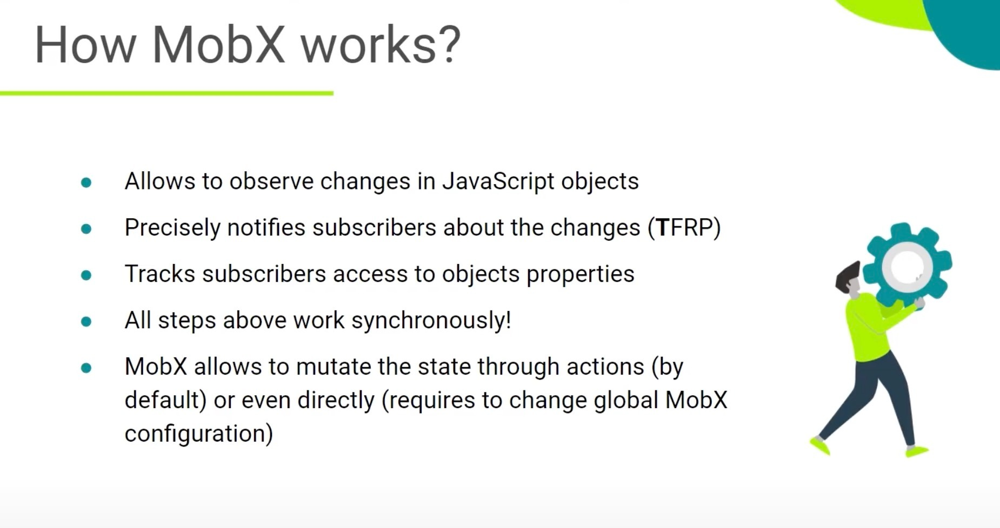

# MobX

## MobX State Management System

### What is MobX?

**Simple, scalable state management.**
**Anything that can be derived from the application state, should be. Automatically.**

MobX is a battle-tested library that makes state management simple and scalable by transparently applying functional reactive programming. The philosophy behind MobX is simple:

😙 **Straightforward**

-   Write minimalistic, boilerplate-free code that captures your intent. Trying to update a record field? Simply use a normal JavaScript assignment — the reactivity system will detect all your changes and propagate them out to where they are being used. No special tools are required when updating data in an asynchronous process.

🚅 **Effortless optimal rendering**

-   All changes to and uses of your data are tracked at runtime, building a dependency tree that captures all relations between state and output. This guarantees that computations that depend on your state, like React components, run only when strictly needed. There is no need to manually optimize components with error-prone and sub-optimal techniques like memoization and selectors.

🤹🏻‍♂️ **Architectural freedom**

-   MobX is unopinionated and allows you to manage your application state outside of any UI framework. This makes your code decoupled, portable, and above all, easily testable.

